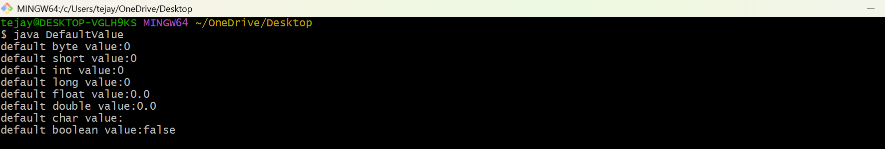

# JAVA-LAB-EXP-1
##TITTLE:-DefaultPremitiveValues Program
```java
class  DefaultPremitiveValues
{
byte b;
short s;
int i;
long l;
float f;
double d;
char r;
boolean bool;
public static void main(String[] args){
DefaultPremitiveValues obj= new DefaultPremitiveValues();
System.out.println("default byte value :"+obj.b);
System.out.println("default byte value :"+obj.s);
System.out.println("default byte value :"+obj.i);
System.out.println("default byte value :"+obj.l);
System.out.println("default bytr value :"+obj.f);
}
}
```
#output

